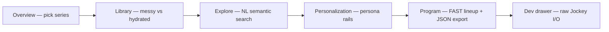
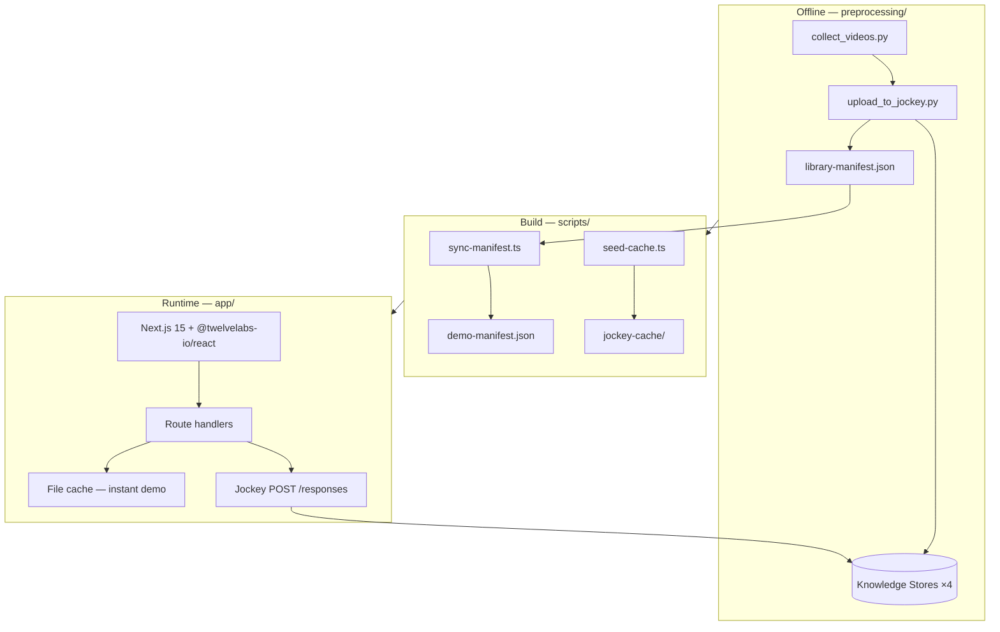

<p align="center">
  <a href="https://www.twelvelabs.io">
    
  </a>
</p>

<h1 align="center">Streaming Intelligence Demo</h1>

<p align="center">
  A sales-ready demo showing how <a href="https://www.twelvelabs.io/product/product-overview">TwelveLabs Jockey</a> turns messy streaming libraries into searchable, personalized, and programmable content engines.
</p>

<p align="center">
  <a href="https://docs.twelvelabs.io/docs/get-started/introduction">API Docs</a> ·
  <a href="https://playground.twelvelabs.io">Playground</a> ·
  <a href="https://www.twelvelabs.io/blog">Blog</a> ·
  <a href="https://www.twelvelabs.io/research">Research</a> ·
  <a href="https://discord.com/invite/mwHQKFv7En">Discord</a>
</p>

---

## Objective

Enterprise streaming buyers (FAST operators, studios, archive teams) sit on libraries they cannot fully monetize: thin metadata, unsearchable archives, shallow personalization, and manual channel programming.

This demo shows **four Jockey capabilities in one executive-friendly workflow** — aligned to [`prd.md`](./prd.md):

| PRD capability | What the buyer sees |
|----------------|---------------------|
| Metadata hydration | Before/after library cards; episode timelines, cast, tags |
| Semantic search | Natural-language scene discovery with timestamps and reasoning |
| Personalized discovery | Persona-based content rails with explainable match signals |
| Smart FAST programming | Channel brief → sequenced lineup with runtime + export |

Target: **5–10 minute live demo**, instant paths via pre-built cache, optional live Jockey calls.

---

## PRD → implementation map

| PRD workflow | App route | Backend | Jockey schema |
|--------------|-----------|---------|---------------|
| Library ingest & hydration | `/{storeKey}/library` | `GET /api/library/[storeKey]` · cache `hydration` | `metadata_hydration` + v2 enrichment |
| Semantic search | `/{storeKey}/explore` | `POST /api/jockey/search` · cache `search` | `semantic_search` |
| Personalized discovery | `/{storeKey}/discover` | `POST /api/jockey/discover` · cache `discover` | `personalized_discovery` |
| Smart FAST programming | `/{storeKey}/program` | `POST /api/jockey/program` · cache `program` | `fast_programming` |
| Developer view | var(--tl-*) | Dev drawer (all routes) | Raw request/response payloads | — |

**Multi-show architecture:** four vertical-specific knowledge stores (one `store_key` per series), swappable from the overview page.

| `store_key` | Series | Vertical | Assets |
|-------------|--------|----------|--------|
| `hells_kitchen` | Hell's Kitchen | FAST / reality | 5 episodes |
| `lizzie_bennet` | The Lizzie Bennet Diaries | Micro-drama | 5 episodes |
| `omeleto_reserve` | The Reserve (Omeleto) | Micro-drama | 4 episodes |
| `french_chef` | The French Chef (Julia Child) | Archive | 4 episodes |

---

## Demo flow (matches PRD)



1. **Load library** — Show assets with thin `messy_metadata` vs Jockey-hydrated fields (genre, mood, cast, timeline beats).
2. **Hydrate wow moment** — Toggle metadata modal; episode timeline + most important scene reasoning.
3. **Semantic search** — Query e.g. *"find the confrontation scene with the woman in the red dress"*; follow-up turns via `session_id`.
4. **Personalized discovery** — Switch viewer profiles; ranked sub-clips with rationale and match signals.
5. **Smart programming** — Channel brief → lineup within ±10% runtime target → one-click JSON export.
6. **Developer mode** — Inspect endpoint, payload, and structured schema alongside the UI.

---

## Architecture



### TwelveLabs layer (Jockey-only)

All capability queries use **`POST /v1.3/responses`** with `model: jockey1.0`, one `knowledge_store_id` per request, and JSON Schema in `text.format`. See [`prd.md` § TwelveLabs API Integration](./prd.md#-twelvelabs-api-integration).

| Component | Location | Role |
|-----------|----------|------|
| Jockey client | `app/lib/jockey/client.ts` | Responses API wrapper + retry |
| Instructions | `app/lib/jockey/instructions.ts` | Per-capability system prompts |
| Schemas | `app/lib/jockey/schemas.ts` | Structured output definitions |
| Cache loader | `app/lib/jockey/load-cache.ts` | Instant demo paths |
| Manifest | `app/data/demo-manifest.json` | Stores, assets, playback URLs, hydration |

**Demo mode:** `seed-cache` pre-generates Jockey responses so sales demos never wait on indexing. Live calls are available via `/api/jockey/*` when `TL_API_KEY` is set.

### Tech stack

| Layer | PRD spec | This repo |
|-------|----------|-----------|
| Frontend | Next.js 14, Tailwind, Zustand | **Next.js 15**, React 19, Tailwind v4, **@twelvelabs-io/react 0.21.0**, Zustand |
| Backend | Python FastAPI | **Next.js Route Handlers** (TypeScript) |
| Preprocessing | Asset upload pipeline | **Python** in `preprocessing/` |
| Deploy | Docker / Fly.io | **Vercel** (+ GitHub Packages auth for UI package) |

---

## Local setup

### Prerequisites

- **Node.js 18+** and npm
- **Python 3.11+** (only if re-running preprocessing)
- **ffmpeg** + **yt-dlp** (preprocessing only)
- **TwelveLabs API key** — [Playground](https://playground.twelvelabs.io)
- **GitHub PAT** (`read:packages`) — for `@twelvelabs-io/react` from GitHub Packages

### 1. Registry auth (UI package)

**Option A — global (recommended, set once):**

```powershell
# File: %USERPROFILE%\.cursor\secrets\.env.registry
# REGISTRY_TOKEN=ghp_...

. "$env:USERPROFILE\.cursor\skills\twelvelabs-ui\scripts\load-registry-env.ps1"
```

**Option B — per-repo fallback:**

```powershell
cp .env.registry.example .env.registry
# edit REGISTRY_TOKEN
. .\scripts\load-registry-env.ps1
```

### 2. App

```powershell
cd app
npm install
cp .env.example .env.local
# TL_API_KEY=...
# KNOWLEDGE_STORE_IDS={"hells_kitchen":"ks_...","lizzie_bennet":"ks_...",...}

npm run prepare-data   # sync-manifest + seed-cache
npm run dev
```

Open [http://localhost:3000](http://localhost:3000).

### 3. Preprocessing (optional — rebuild knowledge stores)

Only needed to re-index assets or add new series. See [`preprocessing/README.md`](./preprocessing/README.md).

```powershell
cd preprocessing
python -m venv .venv
.venv\Scripts\Activate.ps1
pip install -r requirements.txt
copy .env.example .env
python collect_videos.py
python upload_to_jockey.py
```

Then from repo root:

```powershell
cd app
npm run sync-manifest
npm run seed-cache
```

---

## Deploy (Vercel + public GitHub)

The repo is safe to publish. **Never commit tokens.**

| Secret | Where | Purpose |
|--------|-------|---------|
| `REGISTRY_TOKEN` | **Vercel project env** | `npm install` for `@twelvelabs-io/react` |
| `TL_API_KEY` | Vercel project env | Live Jockey calls |
| `KNOWLEDGE_STORE_IDS` | Vercel project env | Route handlers |

Committed files handle the rest:

- `app/.npmrc` — `${REGISTRY_TOKEN}` placeholder (no secret in git)
- `app/data/demo-manifest.json` — store IDs + cached metadata
- `app/data/jockey-cache/` — instant demo responses

**Vercel setup:** Project → Settings → Environment Variables → add `REGISTRY_TOKEN` (Production + Preview). Same PAT as local.

Build command (default): `npm run build` in `app/` (runs `sync-manifest`, `seed-cache`, `next build`).

---

## Project structure

```
netflix-prd/
├── prd.md                    # Product requirements (source of truth for demo narrative)
├── README.md                 # This file
├── scripts/
│   ├── load-registry-env.ps1 # Global or repo REGISTRY_TOKEN loader
│   ├── sync-manifest.ts      # preprocessing → app/data/demo-manifest.json
│   └── seed-cache.ts         # Jockey response cache for demo paths
├── preprocessing/            # Offline: download, compress, upload, index
│   ├── collect_videos.py
│   ├── upload_to_jockey.py
│   └── output/jockey-registry.json
└── app/                      # Next.js demo application
    ├── app/                  # Routes: /, /[storeKey]/{library,explore,discover,program}
    ├── components/           # UI (@twelvelabs-io/react)
    ├── lib/jockey/           # Client, instructions, schemas, cache
    └── data/                 # Manifest + jockey-cache (committed for instant demo)
```

---

## Scripts

Run from `app/`:

| Command | Description |
|---------|-------------|
| `npm run dev` | Local dev server |
| `npm run prepare-data` | `sync-manifest` + `seed-cache` |
| `npm run warm-cache` | Regenerate Jockey cache (needs `TL_API_KEY`) |
| `npm run test` | Playwright API + E2E |
| `npm run build` | Production build |

---

## TwelveLabs resources

Quick reference for sales conversations, technical deep-dives, and follow-up materials.

### Sales & enterprise

| Resource | Link | Use when |
|----------|------|----------|
| Talk to sales | [twelvelabs.io/contact](https://www.twelvelabs.io/contact) | Buyer wants pricing, POC, or account team |
| Enterprise overview | [twelvelabs.io/enterprise](https://www.twelvelabs.io/enterprise) | Security, scale, deployment questions |
| Platform overview | [twelvelabs.io/product/product-overview](https://www.twelvelabs.io/product/product-overview) | Executive summary of the video AI platform |
| Models overview | [twelvelabs.io/product/models-overview](https://www.twelvelabs.io/product/models-overview) | Marengo, Pegasus, Jockey positioning |
| Case studies | [twelvelabs.io/case-studies](https://www.twelvelabs.io/case-studies) | Proof points by vertical |
| Partners | [twelvelabs.io/partners](https://www.twelvelabs.io/partners) | AWS, Snowflake, Databricks co-sell |
| Security | [twelvelabs.io/security](https://www.twelvelabs.io/security) | InfoSec review kickoff |
| Trust center | [trust.twelvelabs.io](https://trust.twelvelabs.io/) | SOC, compliance docs, security questionnaires |
| Pricing | [twelvelabs.io/pricing](https://www.twelvelabs.io/pricing) | Commercial conversation |

### Solutions (by buyer vertical)

| Vertical | Link | Demo tie-in |
|----------|------|-------------|
| Media & entertainment | [twelvelabs.io/solutions-old/media-and-entertainment](https://www.twelvelabs.io/solutions-old/media-and-entertainment) | Streaming, FAST, archive monetization |
| Advertising | [twelvelabs.io/solutions-old/advertising](https://www.twelvelabs.io/solutions-old/advertising) | Contextual placement, scene intelligence |
| Government & security | [twelvelabs.io/solutions-old/government-and-security](https://www.twelvelabs.io/solutions-old/government-and-security) | Air-gapped, evidence, mission use cases |

### Product capabilities

| Capability | Link |
|------------|------|
| Search (Marengo) | [twelvelabs.io/product-old/video-search](https://www.twelvelabs.io/product-old/video-search) |
| Analyze (Pegasus) | [twelvelabs.io/product-old/analyze](https://www.twelvelabs.io/product-old/analyze) |
| Embed (Marengo) | [twelvelabs.io/product-old/embed](https://www.twelvelabs.io/product-old/embed) |

### Technical & developers

| Resource | Link | Use when |
|----------|------|----------|
| API documentation | [docs.twelvelabs.io](https://docs.twelvelabs.io/docs/get-started/introduction) | Integration, Jockey `/responses`, schemas |
| SDKs (Python, JS) | [docs.twelvelabs.io/docs/resources/twelve-labs-sd-ks](https://docs.twelvelabs.io/docs/resources/twelve-labs-sd-ks) | Client libraries |
| Playground | [playground.twelvelabs.io](https://playground.twelvelabs.io) | Live API key, try-your-own-video |
| Developer hub | [twelvelabs.io/developer-hub](https://www.twelvelabs.io/developer-hub) | Tutorials, guides, onboarding |
| Sample apps | [twelvelabs.io/sample-apps](https://www.twelvelabs.io/sample-apps) | Reference implementations |
| Research | [twelvelabs.io/research](https://www.twelvelabs.io/research) | Model papers, benchmarks, Pegasus/Marengo depth |
| Blog & tutorials | [twelvelabs.io/blog](https://www.twelvelabs.io/blog) | DevRel walkthroughs (ad engine, metadata pipeline, etc.) |
| Discord | [discord.com/invite/mwHQKFv7En](https://discord.com/invite/mwHQKFv7En) | Community support |

### Company & news

| Resource | Link |
|----------|------|
| About TwelveLabs | [twelvelabs.io/about-us](https://www.twelvelabs.io/about-us) |
| Series B announcement | [twelvelabs.io/blog/twelvelabs-series-b-100m](https://www.twelvelabs.io/blog/twelvelabs-series-b-100m) |
| Press | [twelvelabs.io/press](https://www.twelvelabs.io/press) |
| Newsletter | [twelvelabs.io/newsletter](https://www.twelvelabs.io/newsletter) |
| Careers | [twelvelabs.io/careers](https://www.twelvelabs.io/careers) |

### Social

| Channel | Link |
|---------|------|
| LinkedIn | [linkedin.com/company/twelvelabs](https://www.linkedin.com/company/twelvelabs/) |
| YouTube | [youtube.com/@Twelve_Labs](https://www.youtube.com/@Twelve_Labs) |
| X (Twitter) | [x.com/twelve_labs](https://x.com/twelve_labs) |

### Legal

| Resource | Link |
|----------|------|
| Terms of service | [twelvelabs.io/legal/terms-of-use](https://www.twelvelabs.io/legal/terms-of-use) |
| Privacy policy | [twelvelabs.io/legal/privacy-policy](https://www.twelvelabs.io/legal/privacy-policy) |
| Legal hub | [twelvelabs.io/legal](https://www.twelvelabs.io/legal) |

---

## License & demo data

Demo videos are rights-cleared or public-domain samples for sales engineering. Jockey knowledge store IDs are in `preprocessing/output/jockey-registry.json` and synced to `app/data/demo-manifest.json`.

Built with the official [TwelveLabs React design system](https://github.com/twelvelabs-io) (`@twelvelabs-io/react`).
