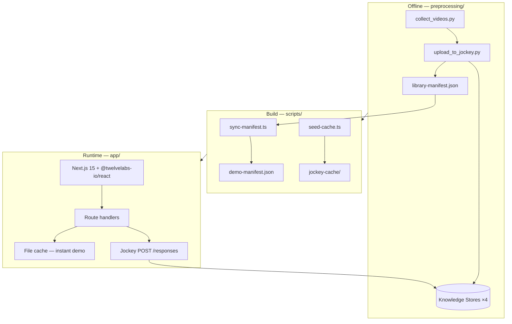

<p align="center">
  <a href="https://www.twelvelabs.io">
    
  </a>
</p>

<h1 align="center">Streaming Intelligence Demo</h1>

<p align="center">
  <strong>Jockey-powered streaming catalog demo built on TwelveLabs</strong><br/>
  Hydrate metadata, search scenes, personalize rails, and program FAST lineups from one knowledge store
</p>

<p align="center">
  <a href="https://docs.twelvelabs.io/docs/get-started/introduction"></a>
  <a href="https://playground.twelvelabs.io"></a>
  <a href="https://www.twelvelabs.io/research"></a>
  <a href="https://www.twelvelabs.io/developer-hub"></a>
</p>

---

## Architecture

<p align="center">
  <a href="https://www.twelvelabs.io/product/models-overview">
    
  </a>
  &nbsp;&nbsp;
  <a href="https://docs.twelvelabs.io/docs/get-started/introduction">
    
  </a>
</p>



**Data flow:** index assets offline → sync manifest → seed Jockey response cache → serve instant demo paths at runtime. Live `POST /v1.3/responses` calls when `TL_API_KEY` is set.

Full PRD and API schemas: [`prd.md`](./prd.md)

---

## Features

| Feature | Description |
|---------|-------------|
| **Metadata hydration** | Before/after library view — cast, moods, episode timelines, most-important-scene reasoning |
| **Semantic search** | Natural-language corpus search with timestamps, match reasoning, multi-turn `session_id` |
| **Personalized discovery** | Persona-based content rails with explainable match signals and sub-clip windows |
| **Smart FAST programming** | Channel brief → sequenced lineup within ±10% runtime target + JSON export |
| **Multi-show architecture** | Four series, four knowledge stores — swap verticals from the overview page |
| **Developer drawer** | Raw Jockey request/response, schemas, and payloads alongside the UI |

### Demo libraries

| `store_key` | Series | Vertical |
|-------------|--------|----------|
| `hells_kitchen` | Hell's Kitchen | FAST / reality |
| `lizzie_bennet` | The Lizzie Bennet Diaries | Micro-drama |
| `omeleto_reserve` | The Reserve (Omeleto) | Micro-drama |
| `french_chef` | The French Chef (Julia Child) | Archive |

---

## Why this demo exists

Streaming catalogs often ship with **title-only metadata** — genre, mood, cast, and scene-level context are missing, so search, personalization, and FAST programming stay manual.

This app shows how **Jockey 1.0** (`jockey1.0` via `POST /responses`) reasons over a pre-indexed knowledge store to:

| Problem | Jockey capability in this repo |
|---------|--------------------------------|
| Thin / missing tags | Metadata hydration + v2 enrichment |
| Can't find moments by description | Semantic search across the library |
| Generic recommendation rails | Persona-based discovery with rationale |
| Manual channel lineups | FAST programming with structured JSON export |

Structured outputs use JSON Schema in `text.format` — ready for downstream rec engines, EPG systems, or analytics pipelines.

---

## Workflow → routes

| Capability | UI route | API | Jockey schema |
|------------|----------|-----|---------------|
| Library hydration | `/{storeKey}/library` | `GET /api/library/[storeKey]` | `metadata_hydration` |
| Semantic search | `/{storeKey}/explore` | `POST /api/jockey/search` | `semantic_search` |
| Personalization | `/{storeKey}/discover` | `POST /api/jockey/discover` | `personalized_discovery` |
| FAST programming | `/{storeKey}/program` | `POST /api/jockey/program` | `fast_programming` |

---

## Required API keys & env

| Variable | Description | Get it from |
|----------|-------------|-------------|
| `TL_API_KEY` | TwelveLabs API key (live Jockey calls) | [Playground](https://playground.twelvelabs.io) |
| `REGISTRY_TOKEN` | GitHub PAT (`read:packages`) for `@twelvelabs-io/react` | [GitHub tokens](https://github.com/settings/tokens) |
| `KNOWLEDGE_STORE_IDS` | Optional override; IDs also in `demo-manifest.json` | Preprocessing output / TwelveLabs dashboard |

**`app/.env.local`:**

```env
TL_API_KEY=your_twelvelabs_api_key_here
KNOWLEDGE_STORE_IDS={"hells_kitchen":"ks_...","lizzie_bennet":"ks_...","omeleto_reserve":"ks_...","french_chef":"ks_..."}
```

**GitHub Packages (local install only):** `%USERPROFILE%\.cursor\secrets\.env.registry` or repo `.env.registry` — see [`.env.registry.example`](./.env.registry.example).

---

## Running locally

### Prerequisites

- **Node.js 18+** (recommended 20+)
- **TwelveLabs API key** — [Playground](https://playground.twelvelabs.io)
- **GitHub PAT** with `read:packages` — for `@twelvelabs-io/react`
- **Python 3.11+**, **ffmpeg**, **yt-dlp** — only if re-running preprocessing

### Setup

```powershell
# 1. Clone and enter repo
git clone https://github.com/<you>/netflix-prd.git
cd netflix-prd

# 2. Auth for @twelvelabs-io/react (pick one)
. "$env:USERPROFILE\.cursor\skills\twelvelabs-ui\scripts\load-registry-env.ps1"
# or: cp .env.registry.example .env.registry  →  edit  →  . .\scripts\load-registry-env.ps1

# 3. App setup
cd app
npm install
cp .env.example .env.local
# Edit .env.local with TL_API_KEY

npm run prepare-data   # sync-manifest + seed-cache
npm run dev
```

Open [http://localhost:3000](http://localhost:3000).

### Rebuild knowledge stores (optional)

See [`preprocessing/README.md`](./preprocessing/README.md) — download → compress → `upload_to_jockey.py` → `npm run sync-manifest && npm run seed-cache`.

---

## Deployment (Vercel)

1. Push to GitHub (public repo is fine — no secrets in git)
2. Import on [vercel.com/new](https://vercel.com/new) — set root directory to **`app`**
3. Add environment variables:

| Variable | Required for |
|----------|--------------|
| `REGISTRY_TOKEN` | `npm install` (`@twelvelabs-io/react`) |
| `TL_API_KEY` | Live Jockey API calls |
| `KNOWLEDGE_STORE_IDS` | Optional if using committed manifest + cache |

Default build: `npm run build` (runs `sync-manifest`, `seed-cache`, `next build`).

---

## Key components

```
app/
├── app/
│   ├── page.tsx                           # Overview — pick series / vertical
│   ├── [storeKey]/library/page.tsx        # Metadata hydration + before/after
│   ├── [storeKey]/explore/page.tsx        # Semantic search + follow-ups
│   ├── [storeKey]/discover/page.tsx       # Persona rails + match signals
│   ├── [storeKey]/program/page.tsx        # FAST lineup + JSON export
│   └── api/
│       ├── jockey/{search,discover,program,hydration}/route.ts
│       └── cache/[storeKey]/...           # Pre-seeded demo responses
├── lib/jockey/
│   ├── client.ts                          # POST /responses wrapper
│   ├── instructions.ts                      # Per-capability system prompts
│   ├── schemas.ts                         # JSON Schema definitions
│   └── load-cache.ts                        # Instant demo path loader
├── data/
│   ├── demo-manifest.json                 # Stores, assets, hydration
│   └── jockey-cache/                      # Cached Jockey payloads
└── components/                            # @twelvelabs-io/react UI

preprocessing/
├── collect_videos.py                      # Download + ffmpeg compress
└── upload_to_jockey.py                    # Assets + knowledge store indexing

scripts/
├── sync-manifest.ts                       # preprocessing → demo-manifest.json
└── seed-cache.ts                          # Build jockey-cache for demos
```

---

## Technology stack

| Layer | Technology | Purpose |
|-------|-----------|---------|
| Video AI | **Jockey 1.0** (`POST /v1.3/responses`) | Corpus-level hydration, search, rails, programming |
| Knowledge stores | TwelveLabs Assets + KS API | Per-series indexed libraries |
| Frontend | Next.js 15, React 19 | App router, route handlers |
| Design system | `@twelvelabs-io/react` 0.21.0 | TwelveLabs UI tokens + components |
| Styling | Tailwind CSS v4 | Semantic token utilities |
| State | Zustand | Demo / dev drawer state |
| Preprocessing | Python 3.11, ffmpeg, yt-dlp | Offline ingest pipeline |
| Deploy | Vercel | SSR + API routes |

---

## Scripts

Run from `app/`:

| Command | Description |
|---------|-------------|
| `npm run dev` | Development server |
| `npm run prepare-data` | `sync-manifest` + `seed-cache` |
| `npm run warm-cache` | Regenerate Jockey cache (needs `TL_API_KEY`) |
| `npm run build` | Production build |
| `npm run test` | Playwright API + E2E |

---

## Resources

- [TwelveLabs API docs](https://docs.twelvelabs.io/docs/get-started/introduction) — Jockey, knowledge stores, structured outputs
- [Models overview](https://www.twelvelabs.io/product/models-overview) — Marengo, Pegasus, Jockey positioning
- [Playground](https://playground.twelvelabs.io) — API key + try-your-own-video
- [Developer hub](https://www.twelvelabs.io/developer-hub) — tutorials and sample patterns
- [Sample apps](https://www.twelvelabs.io/sample-apps) — reference implementations
- [Research](https://www.twelvelabs.io/research) — model papers and benchmarks
- [Blog](https://www.twelvelabs.io/blog) — technical walkthroughs (ad engine, metadata pipelines, etc.)
- [Discord](https://discord.com/invite/mwHQKFv7En) — developer community

---

<p align="center">
  Built by <a href="https://github.com/nathanchess">Nathan Che</a> · Powered by <a href="https://www.twelvelabs.io">TwelveLabs</a>
</p>
